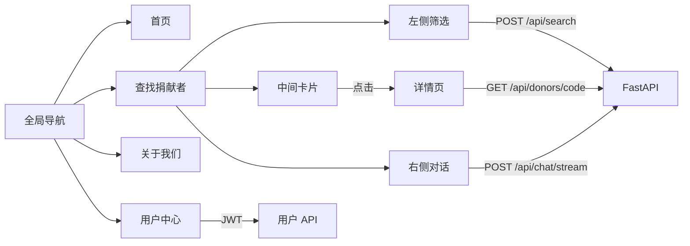

# 站点 UI 改版与用户体系设计

**日期：** 2026-07-29  
**状态：** 待用户确认  
**范围：** React 前端重写 + FastAPI 用户/详情 API 扩展

## 背景

当前产品为 FastAPI + 单页 HTML（`frontend/index_v3.html`），顶栏仅「条件筛选 / 智能对话」模式切换，缺少站点级导航、宣传首页、独立详情页与账号体系。目标是升级为完整站点信息架构，并保留现有匹配与对话能力。

## 已确认决策

| 项 | 选择 |
|---|---|
| 前端技术 | Vite + React + TypeScript + React Router + Tailwind |
| 首页气质 | A · 清透信任（深蓝绿全出血主视觉） |
| 查找页布局 | 左筛选（可收缩）+ 中卡片 + 右智能对话 |
| 用户中心 | 完整版：资料、收藏、浏览/匹配历史、对话同步、筛选偏好 |
| 登录方式 | 邮箱 + 密码 |
| 文案 | 由实现方根据产品起草（首页 / 关于我们） |
| 旧 HTML | 保留作参考；生产入口切到 React 构建产物 |

## 信息架构与路由

| 路由 | 页面 | 说明 |
|---|---|---|
| `/` | 首页 | 宣传引导，主 CTA 进入查找 |
| `/donors` | 查找捐献者 | 三栏工作台 |
| `/donors/:code` | 捐献者详情 | 卡片点击进入 |
| `/about` | 关于我们 | 滚动阅读页 |
| `/user` | 用户中心 | 需登录 |
| `/login` `/register` | 认证 | 邮箱密码 |

全局顶栏：品牌 + 四项导航（首页 / 查找捐献者 / 关于我们 / 用户中心）+ 登录态入口。

## 前端架构

- 新建目录：`agent/web/`
- 开发：Vite dev server 代理 `/api` → FastAPI
- 生产：构建 `web/dist`，由 FastAPI 挂载并 fallback 到 `index.html`（SPA）
- 主题：CSS 变量，清透信任色系（主色偏深蓝绿 / teal-navy，避免 indigo-purple 工具风）
- 字体：非 Inter/Roboto/Arial 默认栈；中文可读 + 有气质的展示字体组合

### 首页 `/`

首屏唯一构图（非仪表盘）：

1. 品牌名（英雄级）
2. 一句主标题
3. 一句支持文案
4. 主 CTA 组（进入「查找捐献者」）
5. 全出血大气主视觉（深蓝绿氛围）

首屏不放统计条、日程、卡片墙。下方可有简短引导区块（匹配方式预告），但不抢首屏。

### 查找捐献者 `/donors`

```
| 左：条件筛选 + 优先级（可收缩） | 中：卡片网格 | 右：智能对话 |
```

- 左栏展开约 280px；收起为窄条（图标/竖排标签），可再次展开
- 复用现有筛选维度与优先级拖拽语义，对接 `POST /api/search`、`GET /api/featured`
- 卡片仅展示：代号、匹配度（有搜索/对话结果时）、学历、身高、血型、年龄、标本数
- 点击整卡 → `/donors/:code`；卡片内不再手风琴展开详情
- 右侧智能对话对接 `POST /api/chat/stream`；候选人结果刷新中间列表
- 已登录用户：筛选/优先级变更可保存为偏好；对话绑定用户会话历史

### 详情页 `/donors/:code`

- 数据：`GET /api/donors/{code}`
- 分区：基本信息 → 外貌 → 性格爱好 → 健康检测 → 标本
- 收藏按钮；登录用户记录浏览历史
- 「在对话中询问」：跳转 `/donors` 并带上该代号上下文（前端打开对话并预填/系统提示）

### 关于我们 `/about`

起草文案分区：使命 → 匹配方式（筛选 + 对话）→ 数据与隐私 → 使用引导。视觉延续首页 A。

### 用户中心 `/user`

- 账户：昵称、邮箱、改密码、退出
- 收藏列表 → 详情
- 浏览历史 + 匹配/搜索历史
- 对话历史：继续/查看
- 筛选偏好：一键应用到 `/donors`

未登录访问 → `/login?next=/user`。

## 后端扩展

保留现有：`/api/featured`、`/api/search`、`/api/chat`、`/api/chat/stream`、`/api/feedback`、`/api/session/{id}`。

新增：

| 方法 | 路径 | 用途 |
|---|---|---|
| POST | `/api/auth/register` | 邮箱注册 |
| POST | `/api/auth/login` | 登录，返回 JWT |
| GET | `/api/auth/me` | 当前用户 |
| PATCH | `/api/auth/me` | 更新昵称等 |
| POST | `/api/auth/change-password` | 改密 |
| GET | `/api/donors/{code}` | 单条详情 |
| GET/POST/DELETE | `/api/user/favorites` | 收藏 |
| GET/POST | `/api/user/history` | 浏览/匹配历史 |
| GET/POST | `/api/user/preferences` | 筛选与优先级偏好 |
| GET/POST | `/api/user/chats` | 对话记录同步 |

持久化：SQLite（`agent/data/app.db` 或同类路径）。密码：bcrypt/passlib 哈希。认证：JWT（Bearer）。

对话同步策略：登录后创建/恢复用户绑定的 session；关键消息与候选人摘要落库，列表页可继续。

## 数据流（查找页）



## 非目标（本次不做）

- 短信验证码 / 第三方 OAuth
- 管理后台 / 捐献者数据录入后台
- 支付与订单
- 将旧 `index_v3.html` 同步维护为第二套生产 UI

## 验收标准

1. 顶栏四项导航可用，不再出现「条件筛选 / 智能对话」作为主导航。
2. 首页气质符合「清透信任」，有明确进入查找页的 CTA。
3. 查找页三栏可用；左栏可收缩；卡片信息精简；点击进详情。
4. 右侧智能对话可完成流式对话并更新中间候选人。
5. 邮箱注册/登录可用；用户中心五块功能可读写。
6. 关于我们页面有完整可用文案。
7. 生产路径下 FastAPI 正确服务 React SPA 与 API。

## 风险与说明

- React 重写工作量大：优先打通路由壳 → 查找三栏（复用 API）→ 详情 → 认证 → 用户中心 → 首页/关于打磨。
- 对话历史与现有内存 `SessionManager` 需桥接落库，避免重启丢登录用户记录。
- Excel 捐献数据仍为只读匹配源；用户数据与捐献主数据分离存储。
